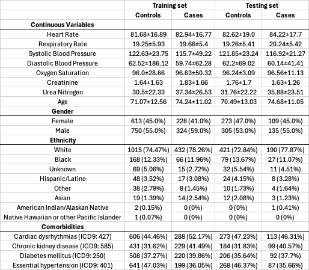

# Learning Physiological Mechanisms that Predict Adverse Cardiovascular Events in Intensive Care Patients with Chronic Heart Disease
Code used to train a tropical geometry fuzzy neural network to predict adverse cardiovascular events in patients with chronic heart disease in the intensive care unit (MIMIC-III database). Note, to replicate this you will need to adjust hard-coded paths in the scripts we provide. This work was presented at IEEE EMBC 2024.

## Materials and Methods
### Dataset

The MIMIC-III database is a public de-identified dataset of 53,423 ICU encounters from 38,597 adult patients at Beth Israel Deaconess Medical Center in Boston, USA, from 2001-2012. Each encounter includes comprehensive data on medications, diagnoses, procedures, laboratory tests, vitals, and patient demographics. Researchers have used MIMIC-III to investigate a range of clinical outcomes and relationships, including chronic heart disease.

### Data Preprocessing and Experiments
We selected a cohort of adult patients (18-89 years old) with chronic heart disease (ICD9 codes 428.0 and 414.01) whose first ICU encounter lasted between 12 hours and 10 days. For consistency, we only used encounters recorded in the MetaVision electronic health record system. The resulting cohort of 2,717 patients contains 796 (29%) patients that either returned to the ICU within one year and underwent a serious cardiac procedure or died. The other 1,941 (71%) patients had no such recorded event within a year. See Table I for a statistical overview of the cohort.

We used the software tool FIDDLE to extract the encounter data from the MIMIC-III database. These data included vital signs, laboratory tests, demographics, diagnoses, and medications. Patients were randomly split into training and testing sets in a 70:30 ratio. For each patient encounter, we computed summary statistics (mean and standard deviation) for each continuous variable over the entire encounter duration. We also included Glasgow Coma Scale (GCS) variables. Categorical variables, including demographics, diagnoses, and medications, were one-hot encoded.

To prioritize the most relevant variables, we used several approaches. First, we hand-selected vitals and laboratory values commonly recorded in ICUs and used in similar studies. We removed rare diagnoses and medications that occur in <1% of the training set patients. Then, we employed minimum redundancy—maximum relevance feature selection on the training set to identify the best 30 variables according to their relevance to the classification label and redundancy with other variables. Finally, missing numerical data was imputed using k- Nearest Neighbors. We standardized features for all models besides the TGFNN. To adjust for class imbalance, we computed weights for each class by dividing the total number of patients in the training set by twice the number of training set patients in the class.

We performed 3-fold cross validation to tune the hyperparameters of the TGFNN, logistic regression, and random forest models.

### Topical Geometry Fuzzy Neural Network
The TGFNN is a neural network developed by Yao et al. that employs fuzzy logic and tropical geometry to create an interpretable and flexible classifier [12]. We use this model because it performs well and learns interpretable, predictive rules. Specifically, the TGFNN can model imprecise medical concepts like “low blood pressure” using a fuzzy framework. Model interpretability is important in healthcare settings for clinical validation and implementation. For a full description of the TGFNN, see [original publication](https://pubmed.ncbi.nlm.nih.gov/36194714/).

We briefly describe the structure of the TGFNN here. The network consists of three modules: the encoding module, the rule module, and the inference module.
The encoding module consists of a single layer that maps each continuous input variable to three fuzzy concepts: low, medium, and high. Variable-concept memberships values are in the range [0,1]. The concept-membership functions are learned during training. A trainable parameter controls the smoothness of the functions using tropical geometry to interpolate between piecewise linear and smooth operations. Categorical variables are one-hot encoded into concepts.

The rule module learns the predictive rules and contains two layers. The first layer learns an attention matrix A that contains the contribution of each variables’ concepts to each rule. The second layer learns a connection matrix M that defines the rules by learning the importance of each variable to each rule. All matrix weights are in range [0,1] due to a hyperbolic tangent activation function. The module has an output for every rule, which is computed using the norm and tropical geometry to interpolate between product minimum operations.

The inference module is a fully connected layer with a node for every output class. Learned weights correspond to the contribution of rules to the output class.
We can extract the predictive rules by (1) computing the product of A and M and (2) extracting their weights in the inference layer. For example, a rule may be interpreted as “if x1 is high and x2 is low, predict class c.” The TGFNN is trained using a loss function that summates the standard cross-entropy loss, a rule sparsity-enforcing term, a rule correlation-penalizing term, and novel rule contradiction-penalizing term. The rule contradiction term ensures that not all concepts of a variable are important within a rule by computing the L1-norm of the minimum concept importance scores across all variables and rules. We trained the network with the Adam optimizer and backpropagation. We implemented the TGFNN in Pytorch 2.0 using Python 3.9.

## Running the Code
### Worflow
1. Request access for and download the [MIMIC-3 database](https://mimic.mit.edu/). For this workflow, we unzipped the tables so we could query the CSVs directly using Pandas in Python
2. **Somewhat optional** Clone the [FIDDLE experiments repo](https://github.com/MLD3/FIDDLE-experiments) and create the conda environment for it and run `1_data_extraction
/extract_data.py`. Our `1_get_cohort.py` script uses some intermediate files from this (`prep/icustays_MV.csv`, `prep/procedureevents_mv.p`, `prep/items_table.csv`) however this isn't necessary. You could use the original MIMIC-III files and then filter them as you'd like
3. Run `1_get_cohort.py` to generate the ICU stay IDs for the cohort in `HF_cohort.csv`
4. Run `2_make_labels.py` to do some additional filtering to create `HF_24.0h.csv`
5. Run `3_preprocess.ipynb` to do all the data preprocessing, formatting, feature selection, and imputation to input into machine learning models
6. Run `4_cohort_stats.ipynb` to generate overview information about the cohort
7. Run `5_run_cv.sh` to submit a SLURM job to hyperparameter tune, train, and evaluate a logistic regression, random forest, and TGFNN model
8. Run `6_get_rules_figure.ipynb` to generate the TGFNN rule heatmap

### Required Libraries
- If using Fiddle, see the [FIDDLE experiments repo](https://github.com/MLD3/FIDDLE-experiments) for requirements
- numpy
- sklearn
- scipy
- matplotlib
- seaborn
- pandas
- PyTorch
- icd9cms
- mrmr
